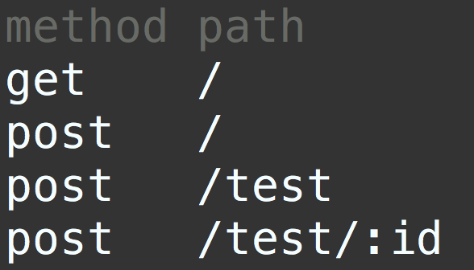

# express-routes-list

<!-- travis https://travis-ci.org/ -->
<!-- appveyor https://ci.appveyor.com -->
<!-- codecov https://codecov.io/gh -->
<!-- npm version badge: https://badge.fury.io/ -->

Confirm routing on the terminal.

## Install
```
$ npm install express-routes-list --save-dev
```

## Usage
```javascript
'use strict';

const express = require('express');
const app = express();
const routesList = require('express-routes-list');

app.get('/', (req, res) => {
  res.send('Hello World');
});

app.post('/', (req, res) => {
  res.send('Hello World');
});

app.post('/test', (req, res) => {
  res.send('Test');
});

app.post('/test/:id', (req, res) => {
  res.send('Test');
});

// add
if (process.env.NODE_ENV === 'development') {
  routesList(app);
}

app.listen(3000);
```

```sh
$ npm start
# you should write to package.json as a npm script
# "express-routes-list": "express-routes-list"
$ express-routes-list
```

1. run your express application
2. run express-routes-list


